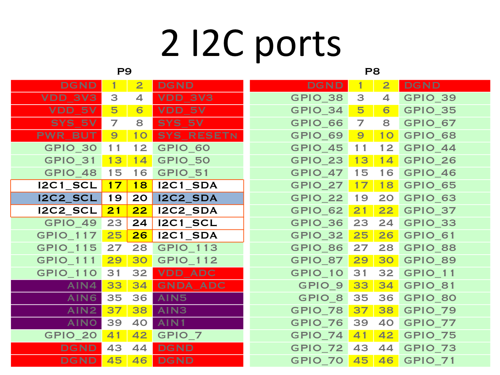
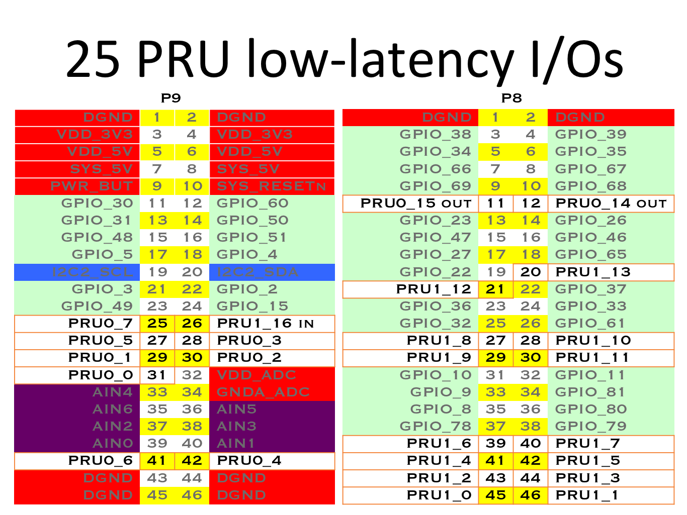
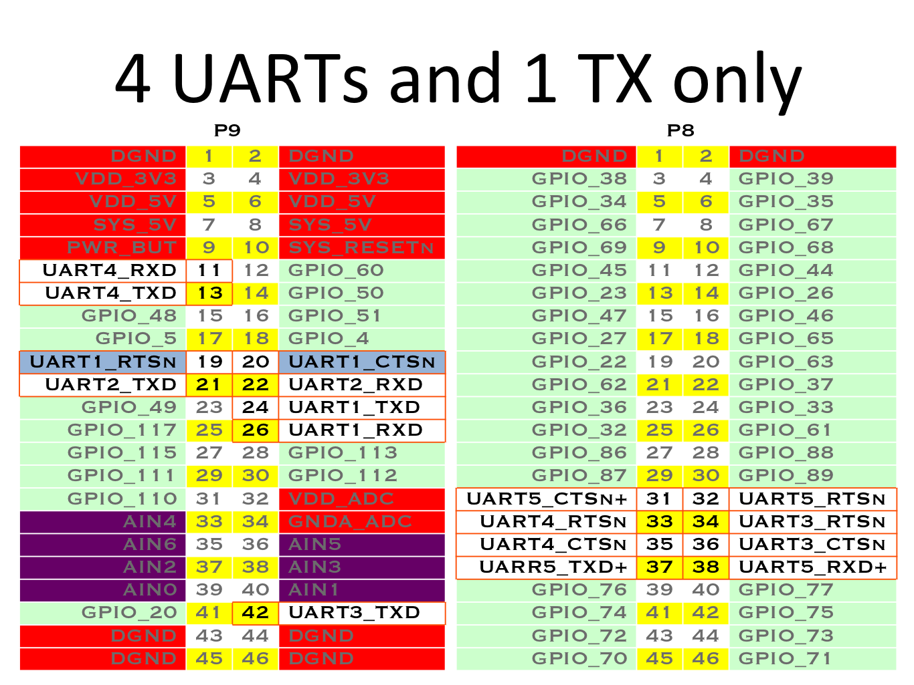

# Beaglebone Black Pin Maps
The following images come from the bone101 page at <http://beagleboard.org/Support/bone101>.
## Basic
### Default EMCC and HDMI Mapping

### Analog

### Digital

## Communication
### Inter-Integrated Circuit

### Programmable Realtime Unit

### Pulse Width Modulation and Timers

### Serial (UART)

### Serial Peripheral Interface Bus

